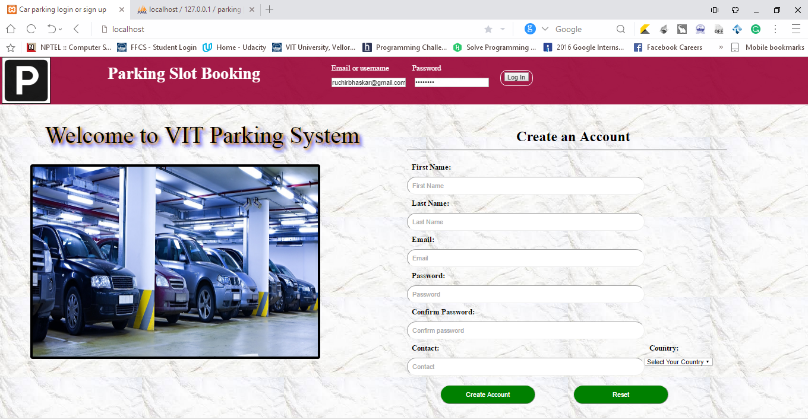
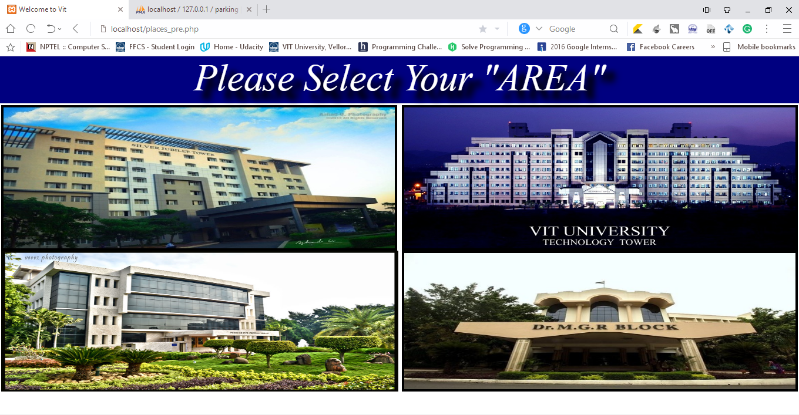
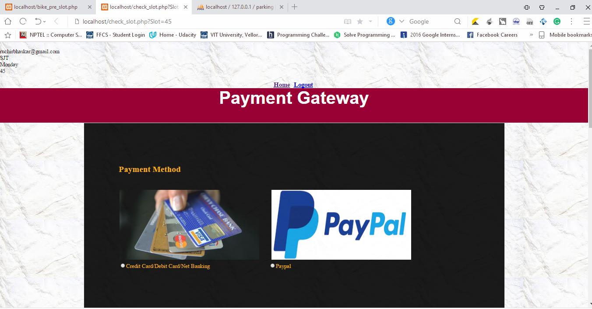

# Parking-System
Online parking booking system which provides customers a way of reserving a parking space online and automatic verification using image processing techniques. 
I completed this as a project for my Software Engineering class during my undergraduate at VIT. The aim is to tackle the present parking problem which is being confronted everywhere throughout the world in various circumstances. This is a standout issue amongst the most concerned issues for developing countries like India.
The system is a slot booking framework which gives users a method for saving a parking slot on the web. The task will be an online reservation framework where users can see different stopping territories and select the space to see whether space is accessible or not. What's more, regardless of whether the slot is reserved or not will be dictated by <i>Optical Number Plate Recognition</i> strategy which utilizes MATLAB. 
The footage obtained from CCTV cameras and process these images to retrieve the number plate. By this number plate we can perform authentication and authorization on the users. We can also check the time when the user exited or entered the spot just by using image processing techniques.   
  
  

